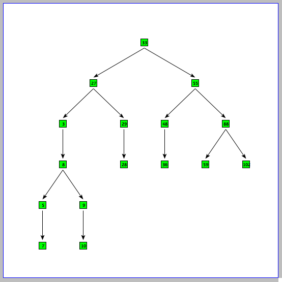
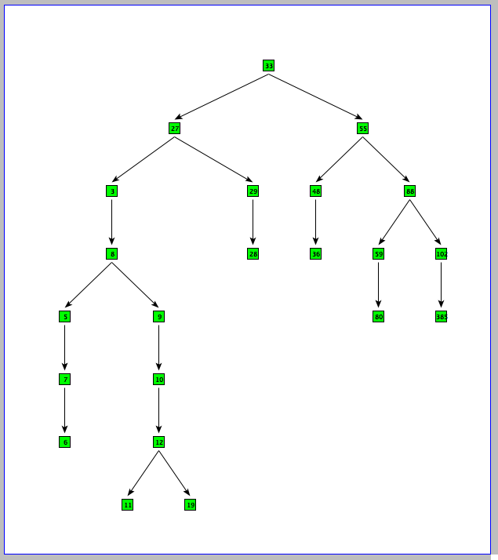
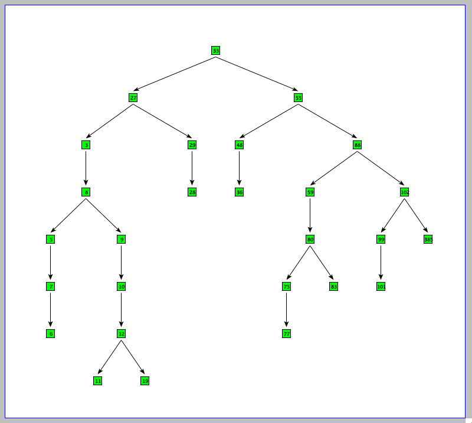

Mozart のプログラム
============================

ShowTree: 2 分木を表示する
----------------------------

ファイルは ShowTree.oz です。

下記のようにリストを読みこませると、MakeBinTree で上から順に 2 分木を作成します。
その後 ShowTree で 2 分木がどのように挿入されたかを画像で表示することができます。

    {ShowTree {MakeBinTree [33 55 48 27 88 36 59 102 3 8 5 29 7 8 9 10 28]}}

    {ShowTree {MakeBinTree [33 55 48 27 88 36 59 102 3 8 5 29 7 8 9 10 28 9 12 385  6 11 12 19 80 27]}}

    {ShowTree {MakeBinTree [33 55 48 27 88 36 59 102 3 8 5 29 7 8 9 10 28
                         9 12 385  6 11 12 19 80 27 29 88 99 101 75 77 83]}}

その他
----------------------------

* HammingProblem: ハミング問題を解く
* HuffmanEncode: ハフマンエンコード・デコードを行うプログラム
* absoluteTriangle: 絶対三角形を計算する

